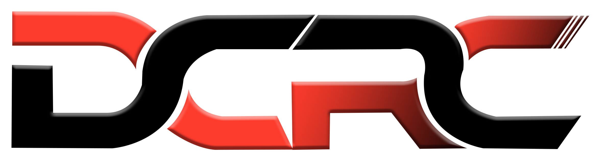

# Our Core Team

We are an international team comprised 5 core members. Our core team members live in USA, South Africa, Brazil and Switzerland. We are an anonymous team due to multiple reasons. We do not plan to publicly dox ourselves, but will consider in the future. We think that through our actions, we have already proven to our community and supporters that we are good actors in this space and will continue to be. [https://rugpullprevention.medium.com/rugpull-prevention-is-now-a-team-effort-e2a260d5d244](https://rugpullprevention.medium.com/rugpull-prevention-is-now-a-team-effort-e2a260d5d244)

[https://twitter.com/AvaxDyor/status/1525481795587870723?s=20\&t=8XmX9G5RcvAvYHtMisvpBw](https://twitter.com/AvaxDyor/status/1525481795587870723?s=20\&t=8XmX9G5RcvAvYHtMisvpBw)

<mark style="color:yellow;">If you are looking for a good way to learn about blockchain tech and grow with a mature, experienced team; please contact us at contact@rugpullprevention.com or one of our official social accounts. We are looking for team members to fit specific roles.</mark>

## <mark style="color:green;">Enebula</mark>

<mark style="color:green;">**Founder**</mark> - Education in web development. Experience in web design, sales, customer service relations and previous career in Industrial Combustion Technologies, Industrial Maintenance and Industrial Maintenance Supervisor.&#x20;

Enebula created The Rugpull Prevention project on May 15, 2021 after seeing a need for the community to come together in a place to speak about the safety of Avalanche projects. It quickly became apparent that the project was needed and we could make a real difference. This is when the plan to automate DeFi safety began to form. Enebula was able to form up with two incredible team members in July and have been working together on the project ever since. With a long term vision and a focus on community, the Rugpull Prevention project is still just beginning it's journey to become a fully automated DeFi safety community.

## <mark style="color:green;">MoBoosted</mark>

<mark style="color:green;">Lead Developer</mark> - Chief Executive Officer of a Wireless ISP and a Software Development and Outsourcing Company. Mo has over 32 years of information technology experience, specializing in the architectural and technical aspects of systems development within the ICT industry. He has designed, constructed and implemented a wide range of applications ranging from legacy mainframe systems to state-of the-art client server business applications.

MoBoosted is also the Founder of DCRC Racing. [https://racex.tech/](https://racex.tech/)

## <mark style="color:green;">Jan Bond</mark>&#x20;

<mark style="color:green;">Chief Financial Advisor</mark> - Jan Bond is a banking professional with over ten years of working experience in client facing roles. Within his positions, he has provided financial services for retail as well as private clients, adhering to local and global regulatory, compliance and risk management standards.&#x20;

Jan Bond\`s passion for the Crypto Market and opportunities created by it, have led him for the past 5 years to gain significant knowledge, develop and pursue several Crypto Projects, among which the risk management and fraud prevention in the crypto market is the most interesting explored so far.

## <mark style="color:green;">Mahapo</mark>

<mark style="color:green;">Developer</mark> - Mahapo is the creator of the website moonmug.net and he developed our Detective's Guild Website! He has been involved with the Rugpull Prevention and Moonmug projects since late 2021, and has been innovating with us ever since. He is highly motivated and shares our team values.





## <mark style="color:green;">Giallo</mark>

<mark style="color:green;">Design</mark> - Giallo is an Avalanche Network community member and has been our Rugpull Detective artist since July 2021. An Artist and Designer, he has a passion for comic-style art and creating unique art like for the [@space\_avalanche](https://twitter.com/space\_avalanche) project currently being developed!&#x20;

.jpg>)
