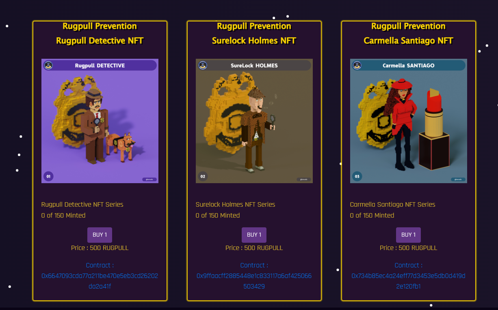
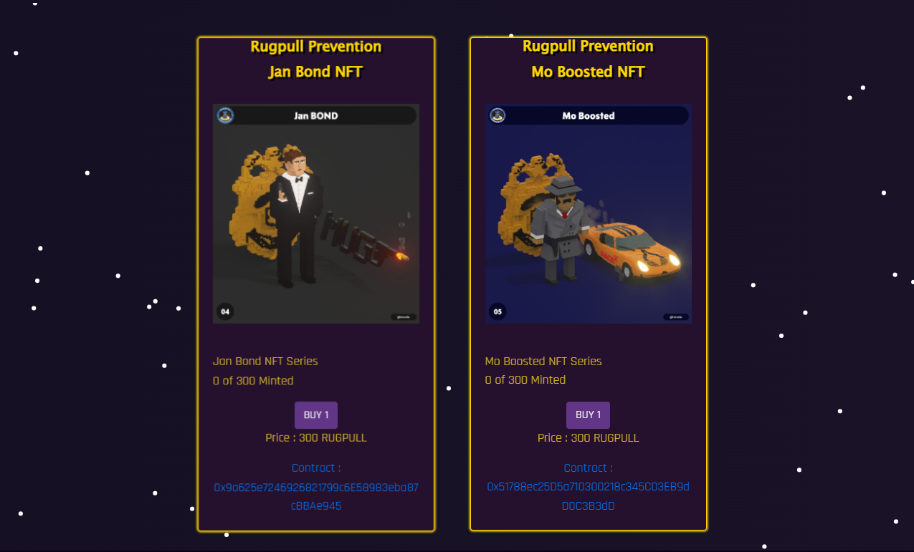

# Detective Series

Visit our Dapp here! You can stake your NFTs to become a verified Detective! Help us give the Avalanche network users unbiased and fair project transparency! [https://rugpullnfts.web.app/](https://rugpullnfts.web.app/)&#x20;

### <mark style="color:green;">NFTs with Utility</mark>

Our Rugpull Prevention NFTs will be used to stake in our Deflationary Staking Dapp.&#x20;

* All NFTs have the same weight even if the price if different. The supply was the deciding factor in the price of the NFTs. That means you will get the same amount of TDG daily per NFT no matter which NFT you stake
* Minting an NFT burns RUGPULL tokens (75% of price)
* Use your rewards to actively participate in verified areas not accessible to the public. This means you are verified on-chain that you are a community member if you are holding TDG tokens.
* With TDG tokens, you can Vote, Rate Comment and List projects by using our Detective's Guild. With our tool, MetaDetect, you can make a difference! Your opinion matters!
* The remaining 25% after mint goes to 10 different community and team members
* Support an Avalanche community artist! Our NFTs were designed by an Avalanche community member!
