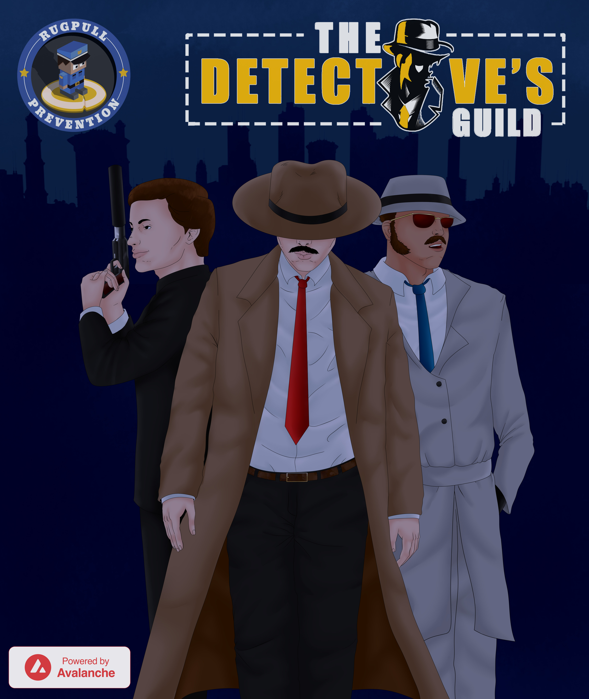

# Why we need a Detective's Guild

### <mark style="color:green;">Decentralized Autonomous Organization (DAO)</mark>

A trustless environment, if developed in the correct way, can become an unbiased source of information made possible through blockchain technologies and community. The Detective's Guild can become a trustless environment that offers the entire Avalanche community useful tools that enable even the most novice of users to defend themselves against the plague of scams within the cryptocurrency industry.

Over time, we will explore the possibility of The Detective's Guild becoming a fully autonomous, legally decentralized entity.

